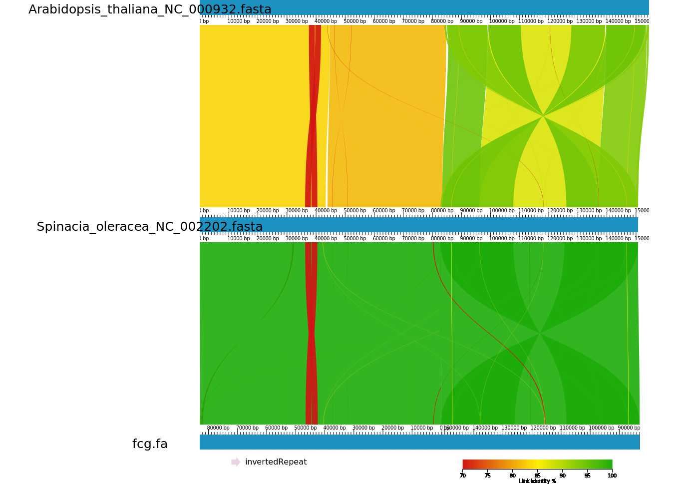

# Assembly of the Spinach Chloroplast

As a demonstration of ChloroExtractors capabilities we assemble the spinach (*Spinacia oleracea*) chloroplast from whole genome shotgun sequencing data.
We use the dataset [SRR4447192](https://trace.ncbi.nlm.nih.gov/Traces/sra/?run=SRR4447192) at SRA which consists of 301 bp paired Illumina reads.
The raw reads were originally used to perform genome assembly of *Spinacia oleracea* to identify genomic SSRs.
This demo can be executed in ~15min on any current desktop workstation or laptop with at least .
I expect that ChloroExtractor and all its requirements are installed, otherwise please refer to the [README](README).

## Download the Data

If you have [sratoolkit](https://www.ncbi.nlm.nih.gov/sra/docs/toolkitsoft/) installed you can download the first 2 million reads of the dataset with the following command:
```
fastq-dump --split-files -X 2000000 SRR4447192
```

## Run ChloroExtractor

To run ChloroExtractor with default configuration just execute (replace <chloroExtractor> with the path where ChloroExtractor is installed):
```
<chloroExtractor>/bin/ptx -1 SRR4447192_1.fastq -2 SRR4447192_2.fastq -o SRR4447192 -d SRR4447192
```

After approximately 10 minutes the ChloroExtractor should be done.
The final candidate chloroplast sequence is in `SRR4447192/fcg.fa`.
If everything worked this should be a single sequence with 151 kbp.

TODO: Discuss intermediate output, especially ptx.pdf, but also log

## Next Steps

### Comparative Genomics
You might want to compare this chloroplast to other existing ones.
For example the reference spinach chloroplast (NC_002202) and that of *Arabidopsis thaliana* (NC_000932) can be used (download the sequences as fasta from NCBI).
One possibility to do this is using [AliTV](https://github.com/AliTVTeam/AliTV).
If you have the perl part and requirements installed you can simply do:
```
<AliTV-perl-interface>/bin/alitv.pl Spinacia_oleracea_NC_002202.fasta Arabidopsis_thaliana_NC_000932.fasta fcg.fa
```
The resulting json file can be imported into this [web interface](https://alitvteam.github.io/AliTV/d3/AliTV.html).
After reverse complementing and rotating (it is circular) the generated sequence, the whole genome alignment looks like this:



So our new sequence actually looks quite similar to the reference chloroplast.

### Genome Annotation

TODO: Point to DOGMA and Verdant
