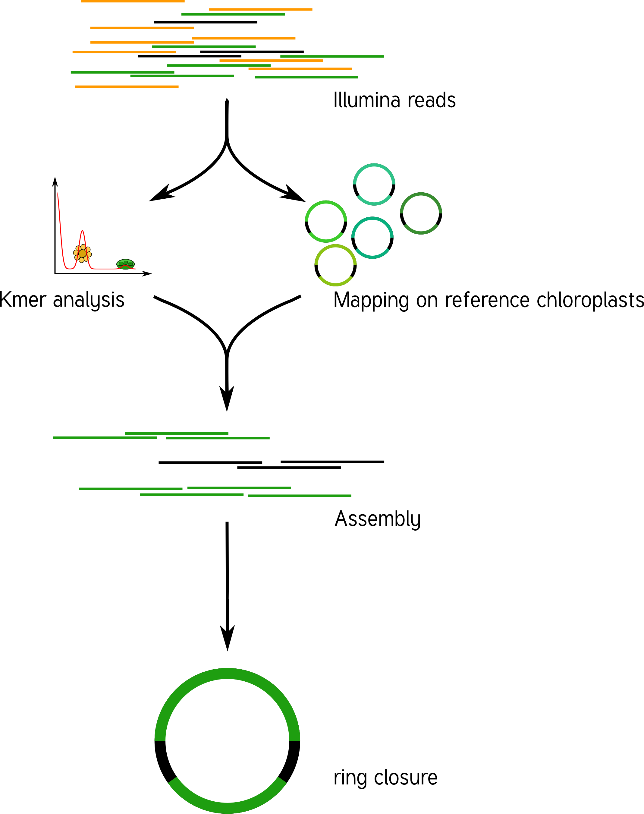

# Summary

This is an automated pipeline that extracts and reconstructs chloroplast genomes from whole genome shotgun data.
It is capable to assemble the incidental sequenced chloropast DNA, which is present in almost all plant sequencing projects, due to the extraction of whole cellular DNA.
It works by analyzing the k-mer distribution (determined with Jellyfish, [@marcais_fast_2011]) of the raw sequencing reads.
Usually the coverage of the chloroplast genome is much higher than that of the nuclear genome.
Using alignments to reference chloroplast sequences and the k-mer distribution candidate chloroplast reads are extracted from the complete set.
Afterwards, the targeted assembly of those sequences is much faster and yields less contigs compared to an assembly of all reads.
Assemblers usually fail to assemble chloroplast genomes as a single contig due to their structure, consisting of two single copy regions and an inverted repeat.
The size of the inverted repeat is in most cases multiple kilobasepairs in size, therefore it can not be resolved using short reads only.
However SPAdes [@Spades_2013] returns the assembly graph where the typical chloroplast structure can be recognized and reconstructed using the knowledge of its structure.
Using our demo set, one can achieve a single contig assembly of the chloroplast of *Spinacia oleracea* .
The final chloroplast sequence can be further annotated with tools like DOGMA [@dogma2004], cpGAVAS [@Liu2012] and VERDANT [@Mckain2017].
Such assemblies, can be used to remove chloroplast reads before a genomic assembly of the remaining nuclear DNA.
Moreover, chloroplast genomes are useful in phylogenetic reconstruction [@huang_2016] or barcoding applications [@Coissac_2016].
A similar tool, aiming the assembly of whole chloroplast genomes is the Python program [org.ASM](https://git.metabarcoding.org/org-asm/org-asm), but it is not production ready, yet.
Also plasmid SPAdes [@plasmidspades_2016] could possibly be used for this purpose although it is not intended for it.
In the future, we plan to use our chloroExtractor to screen NCBI's Sequence Read Archive [@sra2011] for chloroplast genomes in public sequencing datasets that are not yet available in chloroplast databases, eg. chloroDB [@chlordb2006] to broaden our knowledge about chloroplasts.

# Acknowledgements

MJA was supported by a grant of the German Excellence Initiative to the Graduate School of Life Sciences, University of Würzburg.

# References

